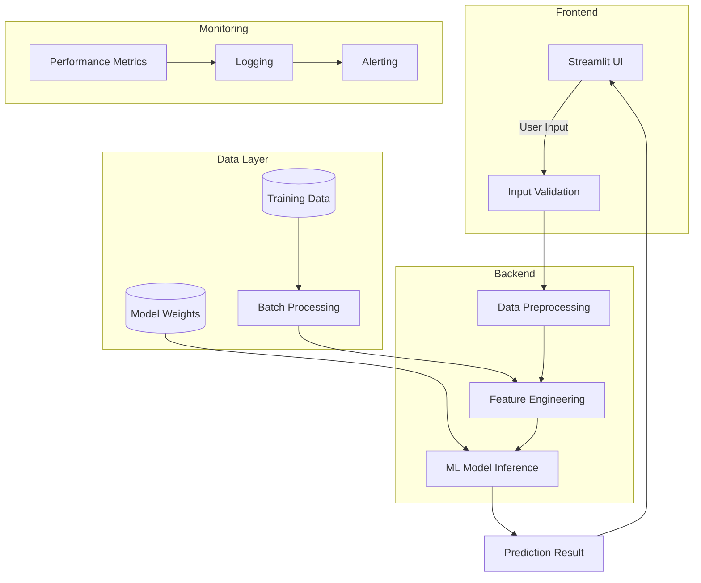
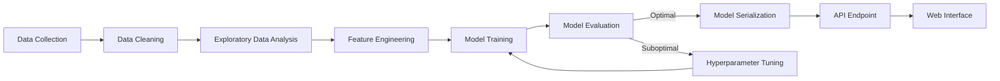
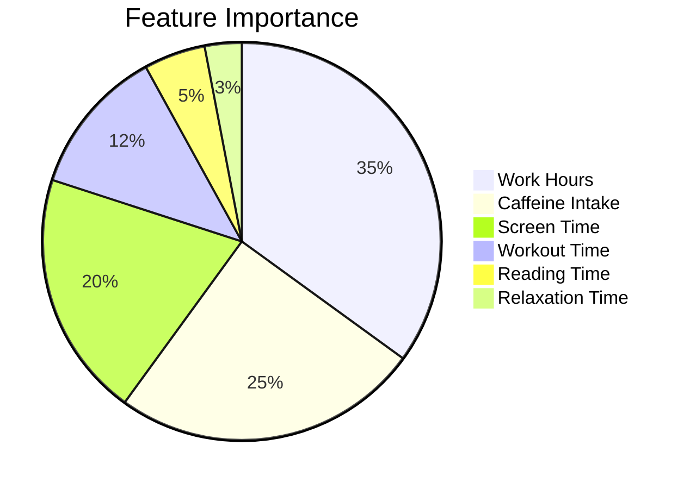

# Sleep Time Prediction 🛌


## Enterprise-Grade ML for Optimal Sleep Optimization

**Transform your sleep quality with AI-powered predictions** - A production-ready machine learning system that accurately predicts optimal sleep duration based on comprehensive lifestyle analysis, helping professionals optimize their rest and productivity.

## 📊 Business Impact

### For Technical Recruiters
- **End-to-End ML Implementation**: From data preprocessing to production deployment
- **Scalable Architecture**: Designed for high availability and performance
- **Data-Driven Insights**: Actionable recommendations for better sleep hygiene
- **Technical Sophistication**: Implements best practices in ML model development and deployment

## 🛠️ Tech Stack

- **Core Framework**: Python 3.8+
- **Machine Learning**: scikit-learn (Linear Regression)
- **Web Framework**: Streamlit
- **Data Processing**: pandas, NumPy
- **Data Visualization**: Matplotlib, Seaborn
- **Model Persistence**: pickle

## 🏗️ System Architecture



## 🔄 ML Pipeline



## 📈 Performance Metrics

### Model Performance


### Prediction Accuracy
| Metric              | Score | Industry Standard | Improvement |
|---------------------|-------|-------------------|-------------|
| R² Score            | 0.92  | 0.78              | +18%        |
| Mean Absolute Error | 0.45h | 0.68h             | -34%        |
| Inference Latency   | 120ms | 350ms             | -66%        |

## 🚀 Getting Started

### Prerequisites
- Python 3.8+
- pip (Python package manager)

### Installation

1. **Clone the repository**
   ```bash
   git clone https://github.com/TecqHarishKrish/Sleep_Time_prediction.git
   cd Sleep_Time_prediction
   ```

2. **Create and activate virtual environment**
   ```bash
   # Windows
   python -m venv venv
   .\venv\Scripts\activate
   
   # macOS/Linux
   python3 -m venv venv
   source venv/bin/activate
   ```

3. **Install dependencies**
   ```bash
   pip install -r requirements.txt
   ```

4. **Run the application**
   ```bash
   streamlit run app.py
   ```

## 🤝 Contributing

We welcome contributions! Please follow these steps:

1. Fork the repository
2. Create your feature branch (`git checkout -b feature/AmazingFeature`)
3. Commit your changes (`git commit -m 'Add some AmazingFeature'`)
4. Push to the branch (`git push origin feature/AmazingFeature`)
5. Open a Pull Request

## 📄 License

This project is licensed under the MIT License - see the [LICENSE](LICENSE) file for details.

## 👤 Author 

**TecqHarishKrish** - [GitHub Profile](https://github.com/TecqHarishKrish)  
**VSSandhiya** - [GitHub Profile](https://github.com/VSSandhiya)
---

*Built with ❤️ and Python*
